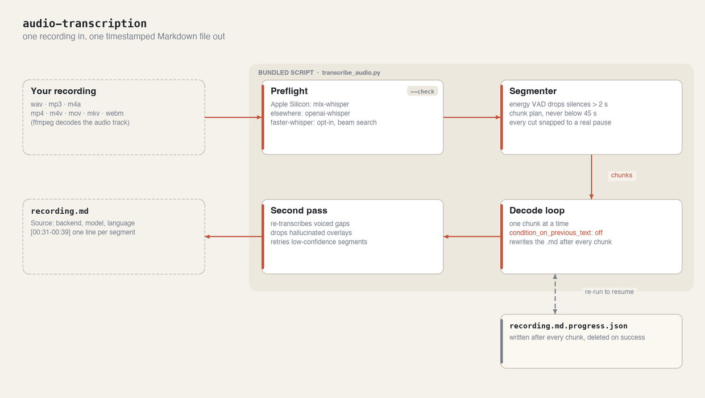
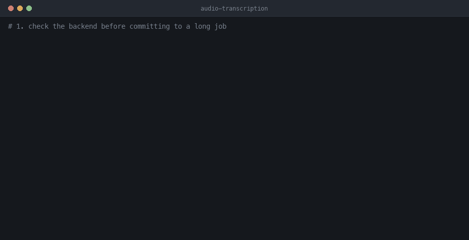

# 🎙️ audio-transcription

An hour of recorded meeting, and the one thing you need is somewhere in the middle of it.
audio-transcription turns `wav`, `mp3` and `m4a` — plus `mp4`, `m4v`, `mov`, `mkv` and `webm` —
into timestamped Markdown you can search, on the Whisper backend your machine is actually fastest on:
`mlx-whisper` on Apple Silicon, `openai-whisper` everywhere else.

## ⚙️ How it works



Whisper's failure modes are specific, and each block above exists to defeat one of them:

- **Preflight** picks the backend for the platform rather than trusting a flag. On Apple Silicon the
  script refuses `--backend whisper` outright, because it's slower *and* less accurate there.
- **Segmenter** drops silences over 2 seconds (Whisper hallucinates "Thank you." into them), keeps
  chunks at 45 seconds or more, and snaps every cut to a real pause so no word is split across a
  boundary. At ~34s chunks that snap is worth 8.8% → 3.7% WER on `large-v3`.
- **Decode loop** runs with `condition_on_previous_text` off, which is what stops Whisper falling
  into minutes-long repetition loops, and it deliberately does *not* carry the previous chunk's text
  across the cut — measured at ~75 words silently deleted when it did.
- **Second pass** audits the transcript against the audio: re-transcribes voiced spans no segment
  covers, deletes hallucinated overlays, and retries segments Whisper's own confidence signals
  flag. It self-gates to near zero extra work on clean recordings.
- **The sidecar** is written after every chunk and deleted on success, which is what makes an
  interrupted run resumable with no extra flag.

Every number here comes from the harnesses in [`evals/`](../../evals), not from intuition.

## 🎬 Demo

A real run: the dependency check, the natural-language ask, 87 seconds of audio transcribed in 8,
and the Markdown it produced. Walked through step by step in [How to use](#how-to-use).



## 📦 Install in Claude Code

```
/plugin marketplace add dmitry-do/ai-toolkit-public
/plugin install audio-transcription@ai-toolkit-public
```

## 🌐 Claude Web

Claude Code only — not available on claude.ai, because it needs local `mlx-whisper`/`ffmpeg` and
reads audio files from your machine, neither of which the claude.ai sandbox provides.

## 🧩 What it does

- Transcribes a single file or a whole folder into Markdown with `[start-end] text` segments and a
  `Source` block (filename, backend, model, detected language).
- **Picks the right backend.** `mlx-whisper` on Apple Silicon (required there), `openai-whisper`
  elsewhere, and an opt-in `faster-whisper` (beam search) for hard, noisy, accented audio.
- **Survives long jobs.** Chunked transcription checkpoints the Markdown after every chunk and
  auto-resumes from a sidecar if the run is interrupted.
- **Defaults tuned for accuracy.** Silence skipping and boundary snapping are on by default; a
  second pass repairs Whisper's silent deletions and hallucinated overlays. Repetition loops are
  disabled at the source (`condition_on_previous_text` off).

The numbers behind every default are measured — see [`evals/`](../../evals) and the "Tested with"
stamp in the skill.

## 📖 How to use

`ROOT=${CLAUDE_PLUGIN_ROOT}/skills/audio-transcription` in the commands below.

### 1. Check the backend before committing to a long job

```bash
python3 "$ROOT/scripts/transcribe_audio.py" --check
```

```
ok       apple_silicon Darwin arm64
info     required     Apple Silicon must use mlx-whisper for this skill
info     mlx_model    mlx-community/whisper-large-v3-mlx
ok       ffmpeg       required for decoding supported audio formats
ok       mlx_whisper  required Apple Silicon backend
```

Whatever is missing is named here. The skill asks before installing a package or pulling model
weights, because both cross the network.

### 2. Ask for the transcript

> "transcribe wap_v1_p1_ch1_clip.mp3, turbo is fine" · "what does this voice memo say?"

The skill detects the platform, picks the backend it's required to use there, and runs the bundled
script. You can also run it yourself:

```bash
python3 "$ROOT/scripts/transcribe_audio.py" wap_v1_p1_ch1_clip.mp3 \
  --mlx-model mlx-community/whisper-large-v3-turbo
```

```
Transcribing wap_v1_p1_ch1_clip.mp3 with mlx-whisper...
Detected language: English
100%|██████████| 8701/8701 [00:03<00:00, 2226.09frames/s]
wap_v1_p1_ch1_clip.md
```

That run is real: 87 seconds of audio, 8 seconds of wall time end to end. Drop `--mlx-model` to get
`large-v3`, the default and the more accurate of the two (3.17% vs 3.33% weighted WER, at ~2.3× the
time).

### 3. Read the output

The Markdown lands next to the audio, same basename:

```markdown
# War and Peace — Ch. 1 (clip)

## Source
- Audio: `wap_v1_p1_ch1_clip.mp3`
- Backend: `mlx`
- Model: `mlx-community/whisper-large-v3-turbo`
- Detected language: `en`

## Transcript

[00:00-00:06] VOLUME I. PART I. CHAPTER I. OF WAR AND PEACE.

[00:06-00:11] This is a LibriVox recording. All LibriVox recordings are in the public domain.

[00:19-00:24] WAR AND PEACE. By Leo Tolstoy. Translated by Nathan Haskell Doyle.
```

The `Source` block records what produced the file, so a transcript is never ambiguous about which
model made it.

### 4. If the run dies, re-run the same command

No flag, no cleanup. A chunked run writes `<output>.progress.json` after every chunk; re-running
the identical command picks up from the last completed one. Change the audio, model, language or
chunk plan and it starts fresh instead of stitching mismatched pieces together.

```bash
python3 "$ROOT/scripts/transcribe_audio.py" long-interview.m4a     # crashed at chunk 6
python3 "$ROOT/scripts/transcribe_audio.py" long-interview.m4a     # resumes at chunk 7
```

### 5. Reach for the other backends only when the audio is hard

```bash
# noisy, accented, far-mic: beam search wins, at ~5.5× the wall time
python3 "$ROOT/scripts/transcribe_audio.py" panel.wav --backend faster --beam-size 5

# not Apple Silicon
python3 "$ROOT/scripts/transcribe_audio.py" panel.wav --backend whisper --whisper-model medium
```

## 🗂️ Structure

```
plugins/audio-transcription/
├── .claude-plugin/plugin.json   # marketplace manifest
├── README.md                    # this file
├── docs/                        # the diagram and demo GIF used above
└── skills/audio-transcription/
    ├── SKILL.md                 # defaults, anti-patterns, "Tested with" stamp
    ├── scripts/transcribe_audio.py   # the transcription script
    └── examples/                # a real worked input → output

evals/audio-transcription/EVALS.md   # behavioral scenarios — NOT installed with the plugin
evals/                               # WER accuracy harness + fixtures — NOT installed
```

Mine, MIT-licensed (see the root [LICENSE](../../LICENSE)).
