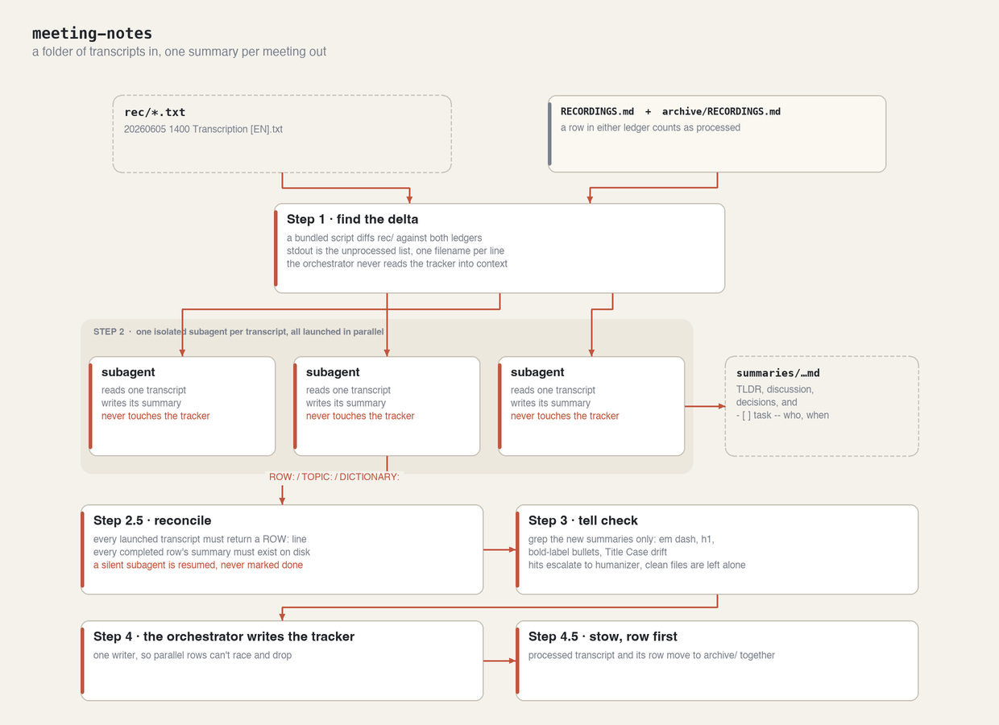
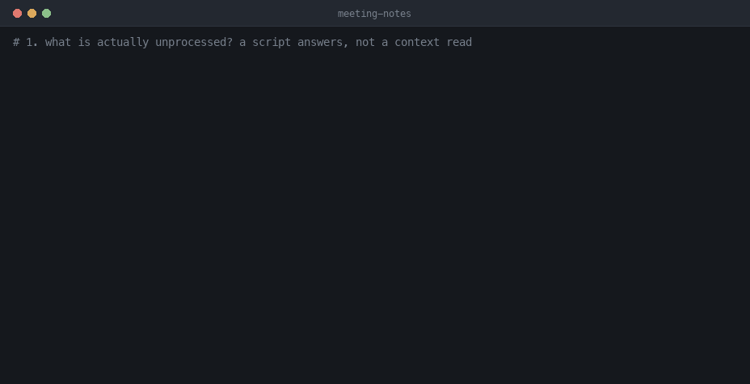
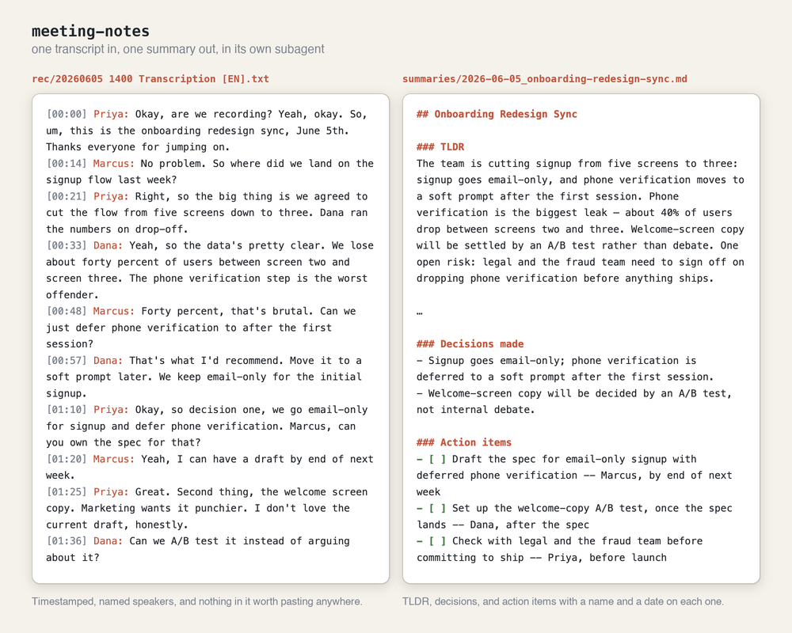

# 📝 meeting-notes

You get back from a week away with eleven transcripts in a folder and no memory of which ones
you've already dealt with. meeting-notes works out what's new, gives each transcript its own
isolated subagent, and writes one readable summary per meeting — TLDR, decisions, and action items
with names and dates on them.

## ⚙️ How it works



Most of the design is about two failure modes that are invisible unless you look for them:

- **Cross-contamination.** One context summarising six meetings blends them — a decision from
  Tuesday shows up in Monday's notes. So each transcript gets its own subagent, and they run in
  parallel because they're independent.
- **The silent subagent.** A subagent's turn can end with no error, no `stop_reason` and its opening
  line as the return value, after it read the transcript but before it wrote anything. Nothing about
  that reads as a failure. **Step 2.5** reconciles reports against launched transcripts and checks
  the summary files exist, and resumes anything that didn't finish. Without it, a meeting is dropped
  for good, because Step 4 never writes a row.

Three more rules earn their place:

- **The orchestrator alone writes `RECORDINGS.md`.** Parallel writes to one tracker race and
  silently drop rows, so subagents return their row instead of writing it.
- **Step 3 greps, it doesn't re-read.** The subagents already humanize as they write; the check is
  mechanical over just the new files, and only files with hits escalate to
  [`humanizer`](https://github.com/blader/humanizer). No output is the success case.
- **Row first, stow second.** A transcript moved before its row exists would be in no ledger and no
  scan path, and would never be seen again. The worst case in this order is a file that the next
  run tidies up.

The reasoning in full, with anti-patterns and validation history, is in
[`references/rationale.md`](./skills/meeting-notes/references/rationale.md).

## 🎬 Demo

Finding the delta mechanically, the parallel subagents, the tell check coming back clean, stowing
what's done, and the summary that fell out. Walked through step by step in
[How to use](#how-to-use).



## 📄 Transcript in, summary out



Left is what the recorder hands you: timestamps, names, and a conversation nobody structured.
Right is what lands in `summaries/` — a TLDR, the decisions as decisions, and action
items with a name and a timeline on each. Both files are in the repo:
[`examples/`](./skills/meeting-notes/examples/) holds the pair the screenshot is of.

## 📦 Install in Claude Code

```
/plugin marketplace add dmitry-do/ai-toolkit-public
/plugin install meeting-notes@ai-toolkit-public
```

## 🌐 Install in Claude Web

Works on claude.ai over uploaded/pasted transcripts (no local `rec/` folder needed — see the
"On Claude Web" note in the skill). Package the skill folder:

```bash
scripts/package-skill.sh meeting-notes        # writes dist/meeting-notes-skill.zip
```

Then in claude.ai: **Customize → Skills → Add → Create skill → Upload a skill**, and select the zip.

## 🧩 What it does

- Archives entries older than three months before each run (Step 0), moving tracker rows and their transcripts together so `rec/` and `RECORDINGS.md` stay small and nothing already done gets reprocessed.
- Finds unprocessed `.txt` transcripts mechanically — a bundled script diffs `rec/` against the `RECORDINGS.md` tracker, so the orchestrator never reads the full tracker into context.
- Launches one subagent per transcript **in parallel**, each fully isolated — no cross-meeting
  contamination, no need to `/clear` between files.
- Writes a dated summary per meeting to `summaries/yyyy-mm-dd_topic.md` with a TLDR, discussion
  points, decisions, and checkbox action items (`- [ ] task -- person, timeline`).
- Detects interview transcripts and switches to an interview template (background, strengths,
  growth areas, decision).
- Translates Russian transcripts to English while preserving names, terms, and meaning.
- Runs a mechanical AI-tell check (grep: em dashes, h1 titles, bold-label bullets, Title Case drift) over each new summary, escalating to the [`humanizer`](https://github.com/blader/humanizer) skill only on files with hits — and only when that skill is installed.

## 📖 How to use

Point it at a project laid out like this — `rec/` for transcripts, `summaries/` for output,
`RECORDINGS.md` as the tracker. `SK=${CLAUDE_PLUGIN_ROOT}/skills/meeting-notes` below.

### 1. Drop transcripts into `rec/`

Named `YYYYMMDD HHMM Transcription [LANG].txt`. The leading date is what the summary filename is
derived from.

```
rec/
├── 20260605 1400 Transcription [EN].txt
└── 20260606 1030 Transcription [EN].txt
```

Only text goes in here. If you have audio, run [`audio-transcription`](../audio-transcription)
first and point this skill at the `.txt` it produces.

### 2. Ask for the notes

```
/meeting-notes
```

> "process the recordings in rec/" · "generate meeting notes"

The first thing it does is ask a script what's actually new, rather than reading the tracker into
context:

```bash
python3 "$SK/archive-old-recordings.py" --root . --list-unprocessed
```

```
20260605 1400 Transcription [EN].txt
20260606 1030 Transcription [EN].txt
```

Empty output means nothing to do, and it says so instead of inventing work.

### 3. One subagent per transcript, launched in parallel

You'll see them go out together and come back with three lines each:

```
ROW: | 20260605 1400 Transcription [EN].txt | 2026-06-05_onboarding-redesign-sync.md | ✅ Completed | 2026-08-21 |
TOPIC: Onboarding redesign sync
DICTIONARY: soft prompt, drop-off
```

Isolation is the point: attendees, decisions and action items from one meeting can't leak into
another, and you never need to `/clear` between files.

### 4. Read the summary

`summaries/2026-06-05_onboarding-redesign-sync.md`:

```markdown
## Onboarding Redesign Sync

### TLDR
The team is cutting signup from five screens to three: signup goes email-only, and phone
verification moves to a soft prompt after the first session. Phone verification is the biggest
leak — about 40% of users drop between screens two and three.

### Decisions made
- Signup goes email-only; phone verification is deferred to a soft prompt after the first session.
- Welcome-screen copy will be decided by an A/B test, not internal debate.

### Action items
- [ ] Draft the spec for email-only signup with deferred phone verification -- Marcus, by end of next week
- [ ] Set up the welcome-copy A/B test, once the spec lands -- Dana, after the spec
- [ ] Check with legal and the fraud team before committing to ship -- Priya, before launch
```

Action items are always checkboxes with a `--` separator, so they paste straight into a task list.
A candidate interview gets a different template (background, strengths, growth areas, decision).

### 5. What the run leaves behind

```
summaries/2026-06-05_onboarding-redesign-sync.md   new
RECORDINGS.md                                      rows appended by the orchestrator, never the subagents
archive/rec/20260605 1400 Transcription [EN].txt   stowed, so rec/ is exactly the pending backlog
archive/RECORDINGS.md                              the full processing history
```

Run it again the next day and it processes only what's new. A transcript that was garbled or too
short gets a `⚠️` row and no invented summary.

## 🗂️ Structure

```
plugins/meeting-notes/
├── .claude-plugin/plugin.json   # marketplace manifest
├── README.md                    # this file
├── docs/                        # the diagram, demo GIF and screenshot used above
└── skills/meeting-notes/        # this folder is what uploads to Claude Web
    ├── SKILL.md                 # workflow + templates
    ├── archive-old-recordings.py # archiving + unprocessed-list helper (unused on Claude Web)
    ├── references/rationale.md  # design rationale, anti-patterns, failure modes
    └── examples/                # a real transcript → summary

evals/meeting-notes/EVALS.md     # behavioral scenarios — NOT installed with the plugin
```

Optionally escalates to the [`humanizer`](https://github.com/blader/humanizer) skill when Step 3's tell check finds issues and that skill is installed — the plugin works fine without it.
Mine, MIT-licensed (see the root [LICENSE](../../LICENSE)).
