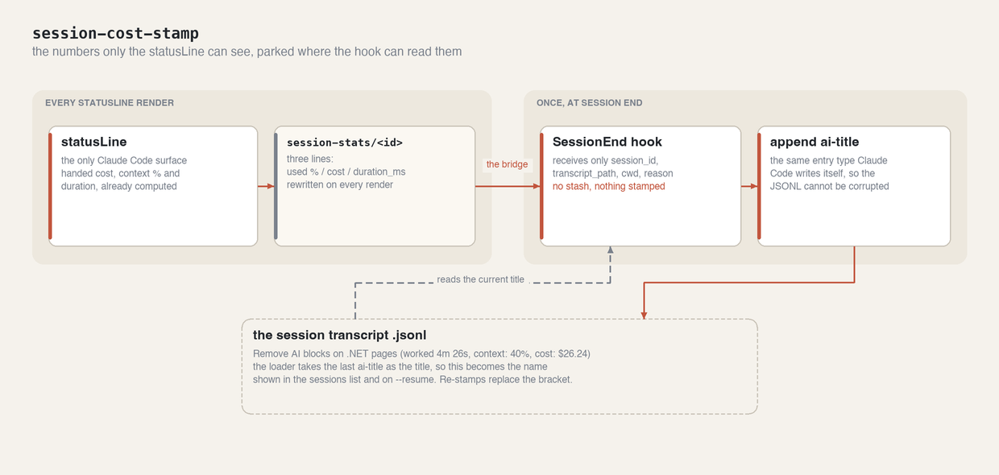
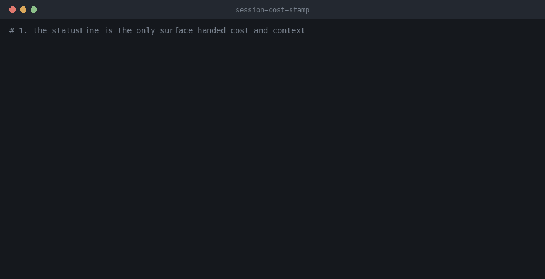

# session-cost-stamp

You finish a long session, close the terminal, and the only record of what it cost closes with it.
session-cost-stamp writes the worked time, context % and dollar cost into the session's own title —
so it shows in the sessions list, shows on `--resume`, and stays in the transcript file for good.

## How it works



1. On every render, your **statusLine** writes `~/.claude/session-stats/<session_id>` with the
   latest context % / cost / duration (the exact UI figures).
2. On session end, the **`SessionEnd` hook** reads that stash and appends a native
   `{ "type": "ai-title", "aiTitle": "...", "sessionId": "..." }` line to the transcript, with the
   stats added in brackets. Because it's the same entry type Claude Code writes itself (~dozens per
   session) and the loader takes the **last** `ai-title` as the title, it can't corrupt the JSONL
   and it becomes the session's title.
3. The stash file is deleted after stamping. Re-stamps **replace** the bracket rather than
   compounding it.

Fires on every session end (`/clear`, logout, exit) with the last figures the statusLine rendered
(≈ final totals). The `$` and context % match the Claude Code UI exactly, because they *are* the
UI's values — the statusLine hands them over pre-computed.

## Demo

The statusLine rendering and stashing, the stash contents, the hook consuming it at session end,
and the title that comes out. Walked through step by step in [How to use](#how-to-use).



## Install in Claude Code

```
/plugin marketplace add dmitry-do/ai-toolkit-public
/plugin install session-cost-stamp@ai-toolkit-public
```

Then **`/reload-plugins`** (or restart) — hooks only take effect after a reload.

## ⚠️ Required: a statusLine that writes the stash

This plugin **cannot function on its own.** A `SessionEnd` hook receives only
`session_id` / `transcript_path` / `cwd` / `reason` — it has **no cost or context data**. Those
numbers exist only in the **statusLine** payload (`cost.total_cost_usd`,
`context_window.used_percentage`, `cost.total_duration_ms`), and Claude Code does not let a plugin
provide a statusLine. So the statusLine has to stash the live figures for the hook to read.

You have two options — pick one:

**A. No custom statusLine yet** — copy the bundled one and point your statusLine at it:

```sh
cp "$(claude plugin path session-cost-stamp@ai-toolkit-public)/scripts/statusline.sh" ~/.claude/statusline.sh
```
```json
// ~/.claude/settings.json
"statusLine": { "type": "command", "command": "bash ~/.claude/statusline.sh" }
```

**B. You already have a statusLine** — don't replace it; paste this block into your script
(it needs `used_pct` and `cost_raw` — the context % and cost you're presumably already reading):

```sh
# --- session-cost-stamp: stash live stats for the SessionEnd hook ---
sid=$(printf '%s' "$input" | jq -r '.session_id // empty')
dur_ms=$(printf '%s' "$input" | jq -r '.cost.total_duration_ms // empty')
if [ -n "$sid" ]; then
  mkdir -p "$HOME/.claude/session-stats" 2>/dev/null
  printf '%s\n%s\n%s\n' "${used_pct:-}" "${cost_raw:-}" "${dur_ms:-}" \
    > "$HOME/.claude/session-stats/$sid" 2>/dev/null
fi
```

Where `used_pct` / `cost_raw` come from the statusLine JSON on stdin:
`jq -r '.context_window.used_percentage // empty'` and `jq -r '.cost.total_cost_usd // empty'`.

No stash → the hook exits quietly and nothing is stamped.

## How to use

### 1. Install, then reload

```
/plugin install session-cost-stamp@ai-toolkit-public
/reload-plugins
```

Hooks only take effect after a reload. Skipping this is the most common reason nothing gets
stamped.

### 2. Wire the statusLine stash

Pick option A or B from the section above. Then confirm the statusLine renders and writes:

```console
$ bash ~/.claude/statusline.sh <<< "$STATUSLINE_JSON"
ai-toolkit  main  •  40% context  •  $26.24
```

### 3. Check the stash actually exists

This is the whole dependency. If this file isn't there, nothing downstream can work:

```console
$ cat ~/.claude/session-stats/$SESSION_ID
40.2       # context used, %
26.2431    # total cost, USD
266000     # duration, ms
```

No file means your statusLine isn't writing it — go back to step 2. The hook exits quietly in that
case rather than stamping a half-empty title.

### 4. End the session

`/clear`, exit, or log out. The `SessionEnd` hook fires, reads the stash, and appends one entry:

```console
$ tail -1 "$TRANSCRIPT"
{"type":"ai-title","aiTitle":"Remove AI blocks on .NET pages (worked 4m 26s, context: 40%, cost: $26.24)","sessionId":"…"}
```

```console
$ ls ~/.claude/session-stats/$SESSION_ID
ls: No such file or directory
```

The stash is consumed, so the same numbers can't be counted twice.

### 5. See it where it's useful

That title is what the sessions list and `claude --resume` now show, and it stays in the transcript
file permanently:

```
Remove AI blocks on .NET pages (worked 4m 26s, context: 40%, cost: $26.24)
```

Re-stamping replaces the bracket rather than compounding it, so a session that ends twice doesn't
end up with two.

## Requirements

- **macOS / Linux**, POSIX `sh`, and **`jq`** on `PATH` (used by the hook and the statusLine).
- A configured statusLine (see above).

## Disable / uninstall

```
/plugin uninstall session-cost-stamp@ai-toolkit-public
```

The statusLine stash block is harmless on its own (it just writes a tiny file each render); remove
it too if you no longer want it.

## Notes

- Claude Web (claude.ai): not applicable — there is no local statusLine or transcript file.
- It writes into your real transcript `.jsonl`. This is deliberate (an existing, native entry
  type), not a foreign line, so it's safe for `--resume`.
