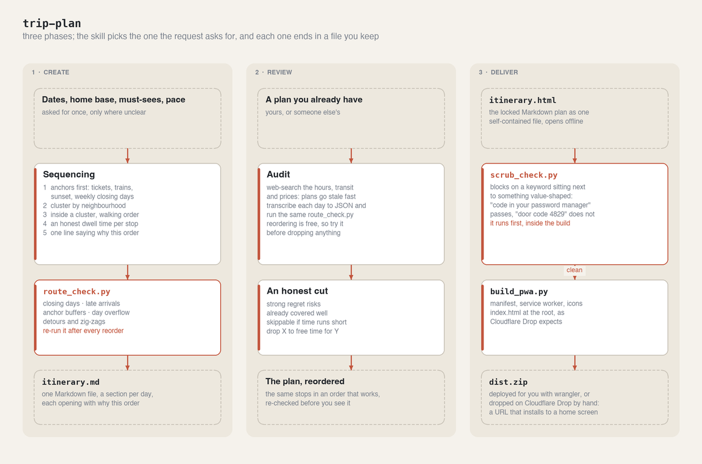
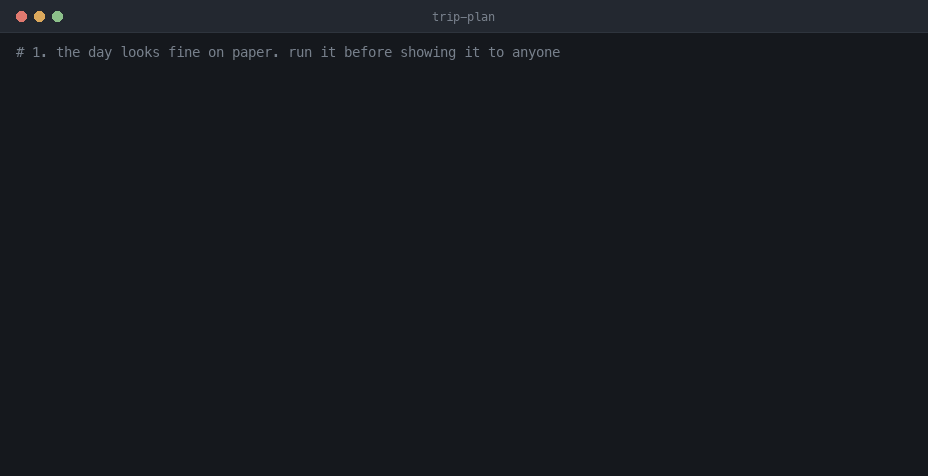
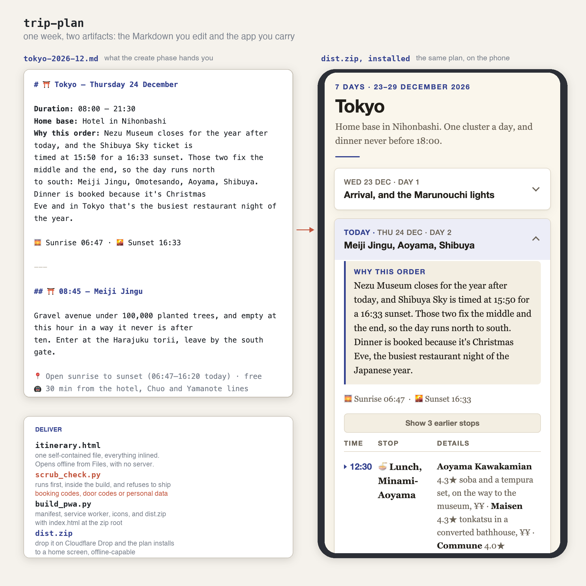

# 🗺️ trip-plan

Four days, a list of places, and no idea what order they go in — and two of them are shut on the
day you planned to go. trip-plan sequences the days around opening hours, travel time and fixed
bookings, audits a plan you already have, and ships the result twice: a Markdown plan you can edit,
and an installable app that sits on the home screen and works with no signal.

## ⚙️ How it works



Three phases that don't chain — the skill enters at whichever one the request asks for.

**Create** works in layers because each one constrains the next. Anchors (timed tickets, trains,
sunset, weekly closing days) can't move, so they go first; clusters get assigned to dates around
them; walking order is decided inside a cluster; dwell time is set last, and when a cluster doesn't
fit, a stop gets cut rather than everything compressed by 20%. Checking closing days *before*
assigning a stop to a date is the single most common way an otherwise good plan breaks.

**`route_check.py`** exists because "this day looks tight" and "you arrive 27 minutes after your
dinner reservation" are different statements, and only one of them is checkable. It's geometry and
arithmetic — closing days, arrival times, anchor buffers, overflow, zig-zags — so it catches what
the eye doesn't. Its zig-zag suggestion is geometry alone, which is why the advice is to re-run the
check on any reordering: the shorter route often lands a museum after closing time.

**`scrub_check.py`** is a build step rather than a promise, because the file gets emailed, synced,
left open on a train table and published to a URL. It blocks on a keyword sitting next to something
value-shaped, which is what lets `code in your password manager` through and stops `door code 4829`.
`build_pwa.py` runs it first and refuses to build a leaky file — and the report masks the value it
found, so the scan output is itself safe to paste.

## 🎬 Demo

A broken day caught by the checker, the reorder that fixes it, the privacy scan blocking a build,
and the same build succeeding once the codes are gone. Walked through step by step in
[How to use](#how-to-use).



## 📱 What you get: Markdown, then an app



Two artifacts out of one plan. **The Markdown** is the one you argue with: a section per day, each
opening with the constraint that set the order, so the reasoning is editable rather than buried.
**The app** is that same plan built into a
[Progressive Web App](https://web.dev/articles/what-are-pwas) — one self-contained HTML file wrapped
with a manifest, a service worker and icons, zipped as `dist.zip`. On a home screen it opens full
screen with no browser chrome, works with no signal, opens on today's card, and folds away the stops
you've already walked past.

The week in that screenshot is a real plan rather than a mockup. The Markdown, the
`route_check.py` JSON for all seven days, and the built HTML the phone is showing are in
[`scripts/docs-assets/samples/`](../../scripts/docs-assets/samples/) — outside the plugin, because
nothing at runtime reads them — and the checker passes clean on it.

## 📦 Install in Claude Code

```
/plugin marketplace add dmitry-do/ai-toolkit-public
/plugin install trip-plan@ai-toolkit-public
```

## 🌐 Install in Claude Web

All three phases work on claude.ai. The scripts are stdlib-only Python 3, so `route_check.py`,
`scrub_check.py` and `build_pwa.py` run there too — the build hands you `dist.zip` as a download
instead of writing a folder to your disk. Publishing is the one real difference: in Claude Code the
skill deploys the folder for you with Wrangler and reads the URL back, while on claude.ai there's no
terminal, so it hands you the zip and you drop it at
[Cloudflare Drop](https://www.cloudflare.com/drop/) yourself. That takes about ten seconds.

Package the skill folder:

```bash
scripts/package-skill.sh trip-plan        # writes dist/trip-plan-skill.zip
```

Then in claude.ai: **Customize → Skills → Add → Create skill → Upload a skill**, and select the zip.

## 🧩 What it does

Three phases, and the skill picks the one the request asks for:

- **Create** — drafts a day-by-day itinerary as Markdown you can edit. Anchors first (timed tickets, trains, sunset, weekly
  closures), then stops clustered by neighbourhood, then ordered by walking distance inside each
  cluster, with an honest dwell time on every stop. Each day opens with a one-line *why this order*
  so the reasoning is arguable, not just the output.
- **Review** — audits an existing plan against the same rules and says plainly what's broken: a
  stop sitting on its closing day, a day that crosses the city four times, a dinner you arrive at
  27 minutes late. Cuts are ranked by regret rather than softened.
- **Deliver** — the locked Markdown becomes one self-contained HTML file (opens offline from Files,
  no server), then the same file wrapped as an installable
  [PWA](https://web.dev/articles/what-are-pwas) with a manifest, service worker, and icons, zipped
  as `dist.zip`. Today's day-card opens on load; stops already past fold away.

## 🔒 Privacy is a build step, not a promise

The plan carries locations, times, prices, and ratings. It never carries booking references, door
codes, passport numbers, card numbers, or personal contact details — because the file gets emailed,
synced, left open on a train table, and published to a URL anyone with the link can read.

The rule is enforced rather than trusted: `build_pwa.py` runs `scrub_check.py` first and refuses to
build a leaky file. The scanner blocks on a keyword next to something value-shaped, so
`code in your password manager` passes and `door code 4829` doesn't.

## 📖 How to use

`SK="${CLAUDE_PLUGIN_ROOT}/skills/trip-plan"` in the commands below. The skill picks its phase from
what you ask for — you don't select one.

### 1. Create: describe the trip

> "four days in Osaka, 27–30 November, staying near Umeda, arriving 14:00 on the 27th. We want food
> markets, one museum, and a proper kaiseki dinner. Balanced pace."

It asks once for anything genuinely missing, then drafts day by day. Each day opens with the
constraint that set the order, so you can argue with the reasoning rather than guess at it:

```markdown
# 🏯 Osaka — Thursday 27 November

**Duration:** 08:30 – 21:30
**Home base:** Hotel near Umeda
**Why this order:** Nakanoshima shuts at 17:00 and closes Mondays, so it anchors the middle of the
day and everything else runs north to south from it.

---

## ☕ 09:00 — Mel Coffee Roasters

Small roaster, ten minutes off the route south. Worth the detour before the museum opens.

📍 4.5 · 1,200+ reviews
🚶 12 min from the hotel
⏱️ Suggested time: 40 min
```

Never asked for, and never stored: booking references, door codes, passport or card numbers.

### 2. Check the day arithmetically, not by eye

Write the day out and run it. Only `name` is required per stop; every check runs on whatever fields
are present:

```json
{"date": "2026-11-30", "home_base": [34.7025, 135.4959],
 "day_start": "09:00", "day_end": "20:00",
 "stops": [{"name": "Nakanoshima Museum", "at": "10:00", "dwell": 90,
            "coords": [34.6923, 135.4917], "hours": "10:00-17:00",
            "closed": ["Mon"], "anchor": false}]}
```

```bash
python3 "$SK/scripts/route_check.py" day.json
```

```
Checking day.json, 1 day(s)
  2026-11-30  ERROR  closed         Nakanoshima Museum is closed on Mon
  2026-11-30  ERROR  tight link     Amerikamura record dig to Sumiyoshi Taisha: leaving 14:35, 37 min transit, arrives 15:11, 27 min late
  2026-11-30  ERROR  anchor buffer  Kaiseki booking is an anchor with 1 min of slack, 30 wanted
  2026-11-30  ERROR  day overflow   670 min of stops and travel in a 660 min day, cut about 10 min
  2026-11-30  warn   detour         Sumiyoshi Taisha adds 11.6 km between Amerikamura record dig and Kuromon Ichiba dinner, move it or drop it

7 problem(s) in the order. Reordering is free and usually fixes more than
cutting stops does, so try the sequence before dropping anything.
```

Errors mean the order is wrong. Warnings are yours to weigh. Reorder and re-run:

```
Checking day.json, 1 day(s)
  2026-11-27  warn   tight link     Mel Coffee Roasters to Nakanoshima Museum leaves 9 min of slack
  2026-11-27  warn   zig-zag        2.7 km of 14.4 km comes back on itself, check hours before applying
Order holds: nothing shut, nothing late, no day over its hours.
```

What it can't tell you is whether the day is worth doing. Two temples in a row passes every check
and still reads as one temple too many.

### 3. Review: hand it a plan someone already wrote

> "here's our Kyoto itinerary, tear it apart"

It web-searches current hours and transit times (plans go stale fast), transcribes each day into
the JSON above, runs the same checker, and then cuts by regret rather than politeness:

- **Strong regret risks** — irreplaceable, seasonal, hard to book
- **Already covered well** — confirm what's solid
- **Skippable if time runs short** — nice but generic
- **Trade-offs** — drop X to free time for Y

### 4. Deliver: build the file and the app

The privacy scan runs first, inside the build, and refuses to produce anything leaky:

```bash
python3 "$SK/scripts/build_pwa.py" --html itinerary.html --out dist \
  --name "Osaka, November 2026" --short-name "Osaka" \
  --theme "#b5533c" --bg "#faf6ef" --initials OS
```

```
  line 2     BLOCK  access code or password  Door code 4***       keep the fact, drop the code: "code in your password manager"
  line 5     BLOCK  booking reference        Confirmation X7**PQ  write "booked, ref in email" and leave the code out

6 blocking finding(s). An itinerary carries locations, times, prices and
notes. Booking codes, door codes and personal details live in the traveller's
email or password manager, not in a file that gets shared and published.

Nothing was built. Fix the file above, or rerun with --allow-pii if you've checked each finding is public venue information.
```

Note the values are masked even in the report. Replace the codes with where to find them, and the
same command builds:

```
  line 4     check  secret wording  password  fine on its own, check no code follows it

No blocking findings. Confirm the flagged items are public venue details.
Built dist (build 1c2eec50f9)
  icons/apple-touch-icon.png            1836 bytes
  icons/icon-192.png                    1928 bytes
  icons/icon-512.png                    5469 bytes
  icons/icon-maskable-512.png           2658 bytes
  index.html                            2995 bytes
  manifest.webmanifest                   849 bytes
  sw.js                                 2243 bytes
Zipped: dist.zip (11388 bytes, files at zip root)
Deploy this directory or the zip. index.html sits at the root, as Drop expects.
```

In Claude Code the skill publishes it for you, because Wrangler deploys a folder without needing a
Cloudflare account:

```bash
npm exec --yes wrangler@latest -- deploy ./dist \
  --name tokyo-december-2026 --temporary --compatibility-date 2026-08-24   # today's date
```

You get a live `workers.dev` URL and a claim URL. The claim URL expires in an hour and grants
ownership of the deployment, so it isn't for sharing. With no terminal — on claude.ai — drag
`dist.zip` onto [Cloudflare Drop](https://www.cloudflare.com/drop/) instead: about ten seconds, same
result.

Either way it installs to a home screen. Today's day-card opens on load; stops already past fold
away.

### 5. Run the fixtures if you change anything

```bash
python3 "$SK/tests/run_tests.py"
```

```
  pass  scrub: the phrasing SKILL.md recommends does not block
  pass  scrub: real codes and numbers still block
  pass  scrub: the masked report never prints the value
  pass  scrub: --allow narrows one category without disarming the rest
  pass  route: a day that holds up passes
  pass  route: closing day, late links, anchor buffer and overflow all caught
  pass  route: half-filled days are checked, not rejected
  pass  build: --out cannot delete the directory holding the itinerary
  pass  build: a foreign non-empty directory is refused, its own output is reused
  pass  build: injection is idempotent and the worker guards what it caches
  pass  build: a leaky itinerary stops the build before anything is written

11 passed, 0 failed
```

## 🗂️ Structure

```
plugins/trip-plan/
├── .claude-plugin/plugin.json      # marketplace manifest
├── README.md                       # this file
├── docs/                           # the diagram, demo GIF and screenshot used above
└── skills/trip-plan/
    ├── SKILL.md                    # sequencing rules, review mode, the privacy rule
    ├── reference/
    │   ├── deliver.md              # HTML build, PWA packaging, Cloudflare Drop deploy
    │   └── style.md                # visual direction for the itinerary page
    ├── scripts/
    │   ├── route_check.py          # day feasibility checker
    │   ├── scrub_check.py          # PII / booking-code scanner
    │   └── build_pwa.py            # HTML → installable PWA + zip
    └── tests/
        ├── run_tests.py            # 11 fixture cases, no framework
        └── fixtures/               # a clean day, a broken day, a safe page, a leaky page
```
